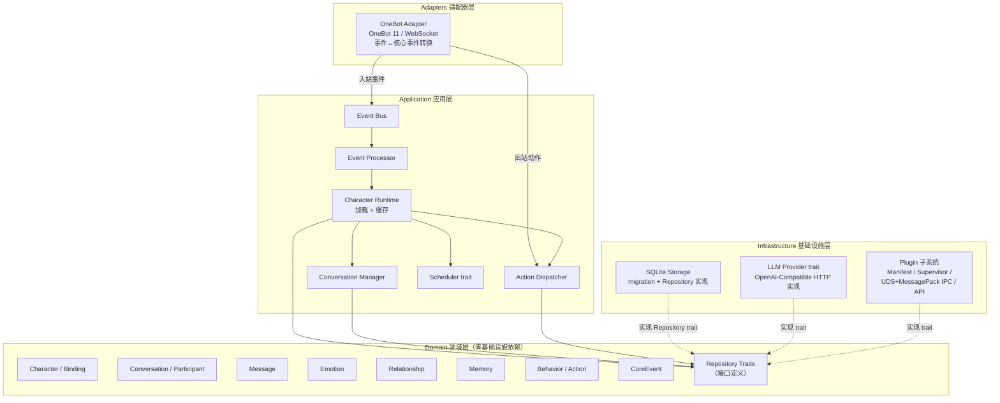

# yomua-bot

> Character Runtime —— 让多个虚拟角色拥有独立人格、状态、关系、记忆和行为逻辑的长期运行框架。QQ（OneBot 11）是第一个消息接入方式，核心与平台无关。

[](LICENSE)
[](#快速开始)

## 目录

- [项目简介](#项目简介)
- [快速开始](#快速开始)
- [核心设计原则](#核心设计原则)
- [技术栈](#技术栈)
- [架构总览](#架构总览)
- [目录结构](#目录结构)
- [当前状态](#当前状态)
- [路线图](#路线图)
- [文档](#文档)
- [贡献指南](#贡献指南)
- [许可](#许可)

## 项目简介

yomua-bot 是一个开源 **Character Runtime / Character Agent Framework**。它不是一个 QQ Bot，而是一个让多个虚拟角色长期运行、拥有独立人格、状态、关系、记忆和行为逻辑的运行时。

核心目标：QQ 私聊/群聊、多 Character 绑定、SillyTavern Card/Lorebook、长期记忆、持久化情绪与关系、主动行为、自然对话、多 LLM Provider、插件扩展、Linux 长时间运行。

> 当前已完成 **Phase 0（Foundation）**、**Phase 1（QQ MVP）**、**Phase 2（Character）**、**Phase 3（AI 对话）**、**Phase 4（记忆）**、**Phase 5（拟人化行为）**、**Phase 6（插件系统）**、**Phase 7（多角色）** 与 **Phase 8（高级认知）**。已实现 OneBot 11 接入、断线重连、消息持久化、配置解析、Character Card 导入（SillyTavern V1/V2/V3 + PNG）、角色绑定、状态生命周期、上下文构建、OpenAI-compatible LLM Provider、LLM Scheduler、确定性行为引擎、情绪/关系/记忆服务、拟人化行为（回复概率、真实延迟、忽略、静默时段、区别对待、状态驱动、主动行为 MVP）、插件系统（Manifest 发现与校验、进程隔离 Supervisor、UDS + MessagePack 语言无关 IPC、权限校验、事件订阅、插件 API、plugin_data 落库）、多角色（每会话单角色、换角色、CLI 管理、指令截流、权限、历史隔离）以及高级认知（后台认知 CognitionDriver、语义记忆 semantic_memories 表 + embedding 列、向量检索 RAG、复杂 Lorebook 混合检索、多 Bot 共群交叉回复）。详见 [当前状态](#当前状态) 与 [路线图](docs/13-roadmap.md)。

## 快速开始

```bash
git clone https://github.com/yomua-cat/yomua-bot.git && cd yomua-bot
cargo build      # 编译通过
cargo test       # 271 个测试通过（1 个 pre-existing 失败，属 Phase 7/8 遗留）
cargo clippy     # 无告警
cargo fmt --check  # 格式正确
```

**当前限制**：以上只验证骨架代码与测试。要真正连接 QQ 还需要本机运行 NapCat（OneBot 11）并配置 `onebot.toml`；LLM 功能需配置 `llm.toml`（默认未启用，未启用时使用确定性回复）。配置文件可选，缺失时使用默认值：`runtime.toml`、`onebot.toml`、`llm.toml`。插件系统默认关闭，需在 `runtime.toml` 配置 `plugins_dir` 启用（见 [Phase 6](#phase-6插件系统已落地)）。

### 角色卡导入（import-card）

把一张 SillyTavern 角色卡（V1/V2/V3 JSON 或 PNG）导入 SQLite，并可绑定到指定 QQ 会话：

```bash
# 仅导入角色（入库 characters + character_states，不绑定）
cargo run -- import-card assets/characters/油木然-bot.json

# 导入并绑定到群聊会话，同时创建人类参与者（预置关系用）
cargo run -- import-card 油木然-bot.png \
    --conversation 88886666 --group \
    --participant 10001 --participant-name 油木然 \
    --reply-mode natural

# 导出选项：--config-dir <目录>、--reply-mode natural|mention|occasional、--proactive
```

导入编排在 `application/character_import`（`CharacterImportService`），解析在 `infrastructure/character_card`，落库走既有 Repository trait，保持分层。


### 初始化配置（待办）

> ⚠️ **TODO（待实现）**：项目初始化流程需包含「创建配置文件」的引导/脚手架步骤。
> 当前配置文件均为可选（缺失时用默认值），由 `cargo run [配置目录]` 在启动时读取；
> 目前**没有**自动生成或校验配置文件的机制，初次使用需手动创建以下文件。

需在初始化流程中包含的配置文件与要点（均为 TOML，放在启动目录下）：

| 文件 | 内容要点 | 是否含敏感信息 | 是否 gitignore |
|------|----------|----------------|----------------|
| `runtime.toml` | `data_dir`（SQLite 数据库目录）、`log_level`、`shutdown_timeout_secs` | 否 | 否（可选）|
| `onebot.toml` | NapCat WebSocket 地址（`websocket_url`）、`access_token`、断线重连与心跳参数 | 可能含 token | **是**（已在 `.gitignore`）|
| `llm.toml` | LLM 开关与 provider：`enabled`、`provider`、及 `[options]` 下 `base_url` / `api_key` / `model` / `timeout_secs` | **是（api_key）** | **是**（已在 `.gitignore`）|

初始化流程待办项（建议实现方式：一个 `cargo run -- init` 子命令或 `scripts/init-config.sh`，检测缺失并生成带注释的模板）：

- [ ] 生成 `runtime.toml` 模板（默认值：`data_dir = "data"`、`log_level = "info"`、`shutdown_timeout_secs = 10`）
- [ ] 生成 `onebot.toml` 模板（引导填写 NapCat 的 `websocket_url` / `access_token`）
- [ ] 生成 `llm.toml` 模板（含 `base_url` / `model`，`api_key` 留占位符引导替换；并在写入侧确认该文件不会被 git 追踪）
- [ ] 校验并给出友好提示：若 LLM 未配置（`enabled=false`）说明将使用确定性回复
- [ ] 提示：任何含密钥的配置不可提交（确保 `llm.toml` 等保留在 `.gitignore`）

参考配置示例：
- `llm.toml`（z.ai 国际版，OpenAI 兼容）：
  ```toml
  enabled = true
  provider = "zai"
  [options]
  base_url = "https://api.z.ai/api/paas/v4"
  api_key = "REPLACE_WITH_YOUR_ZAI_API_KEY"   # 替换为真实密钥
  model = "glm-5.3"
  timeout_secs = 60
  ```
- `runtime.toml`：
  ```toml
  data_dir = "data"
  log_level = "info"
  shutdown_timeout_secs = 10
  # plugins_dir = "plugins"   # 可选：填写后启用插件系统（默认关闭）
  ```
- `onebot.toml`：
  ```toml
  websocket_url = "ws://127.0.0.1:3001"   # 本机 NapCat WebSocket 地址
  access_token = ""
  reconnect_interval_secs = 2
  max_reconnect_interval_secs = 30
  heartbeat_interval_secs = 20
  ```

## 核心设计原则

本项目的架构纪律：

```text
LLM != Character
Character != Conversation
Conversation != QQ
QQ != Core
Emotion != LLM
Behavior != LLM
Memory != Prompt
Plugin != Core
Storage != Domain
```

四层分层：

- **Domain**：Character、Conversation、Message、Emotion、Relationship、Memory、Behavior、Event —— 纯业务模型，不依赖 SQLite/OneBot/LLM SDK/插件。
- **Application**：Runtime 编排、事件处理、行为决策、认知调度、动作执行。
- **Infrastructure**：SQLite 存储、LLM Provider、Plugin Host、IPC、进程管理。
- **Adapters**：OneBot 等平台协议转换，Core 永不直接访问平台 API。

## 技术栈

| 领域 | 选型 |
|------|------|
| 核心语言 | Rust (2021 edition) |
| 异步运行时 | Tokio |
| 数据库 | SQLite（`sqlx`，正式 migration） |
| 序列化 | serde / serde_json |
| 错误处理 | thiserror |
| 日志 | tracing / tracing-subscriber |
| OneBot 接入 | WebSocket（`tokio-tungstenite`）+ `futures-util` |
| 配置 | toml |
| IPC（插件） | UDS + MessagePack（`rmp-serde`，长度前缀帧协议） |
| LLM | OpenAI-compatible Provider（`reqwest`，Chat Completions） |
| 目标平台 | Linux 长时间运行（开发环境 macOS 亦可） |

## 架构总览



依赖方向：**Adapters → Application → Domain ← Infrastructure**。Domain 不依赖任何层；Infrastructure 通过 trait 实现 Domain 定义的接口（依赖倒置）。

## 目录结构

```text
src/
├── main.rs / lib.rs            # 程序入口与库根
├── error.rs                    # 统一错误类型
├── domain/                     # 领域层 —— 纯模型，零基础设施依赖
│   ├── character.rs            # Character / Definition / State / Binding
│   ├── conversation.rs         # Conversation / Participant
│   ├── message.rs              # Message / MessageContent / Attachment
│   ├── emotion.rs              # EmotionState（确定性模型，含 decay）
│   ├── relationship.rs         # Relationship（Character × Participant）
│   ├── memory.rs               # Memory / MemoryType
│   ├── behavior.rs             # BehaviorDecision / Action / BehaviorEngine trait
│   ├── event.rs                # CoreEvent（平台无关事件）
│   └── repository.rs           # 所有 Repository trait 定义
├── application/                # 应用层 —— 编排与调度
│   ├── runtime.rs              # CharacterRuntime（按需加载 + 缓存 + 状态生命周期）
│   ├── event_bus.rs            # EventBus（tokio broadcast）
│   ├── event_processor.rs      # 事件路由 → 回复处理器
│   ├── config.rs               # 配置解析（runtime/onebot/llm）
│   ├── conversation.rs         # ConversationManager（外部 ID ↔ 核心 ID）
│   ├── message_persistence.rs  # 消息持久化订阅者
│   ├── action.rs               # ActionDispatcher → 适配器调用
│   ├── binding.rs              # BindingManager（角色 ↔ 会话绑定）
│   ├── context.rs              # ContextBuilder（上下文组装：消息 + lorebook + 记忆/情绪/关系）
│   ├── cognition.rs            # CognitionLayer（上下文构建 + 经 LLM Scheduler 协调）
│   ├── llm_scheduler.rs        # LLM Scheduler（统一网关：背压 + 优先级）
│   ├── behavior_engine.rs      # RuleBehaviorEngine（确定性行为决策）
│   ├── reply_processor.rs      # Reply Pipeline（消息回复编排）
│   ├── emotion_service.rs      # 情绪读取/更新/持久化
│   ├── relationship_service.rs # 关系读取/更新/持久化
│   ├── plugin_api.rs           # 插件 API 分发（权限门 + 领域能力调用）
│   └── scheduler.rs            # Scheduler trait
├── infrastructure/             # 基础设施层 —— 具体实现
│   ├── storage/                # SQLite 连接池 + migration + 10 个 Repository 实现
│   ├── llm/                    # LlmProvider trait + OpenAI-compatible HTTP 实现
│   ├── character_card/         # SillyTavern 卡片导入（V1/V2/V3 JSON + PNG）
│   └── plugin/                 # 插件系统：协议/清单/权限/注册表/传输/Supervisor/事件桥接
└── adapters/                   # 适配器层
    └── onebot/                 # OneBot 适配器
        ├── mod.rs              # OneBotAdapter trait + 装配
        ├── conversion.rs       # OneBot JSON ↔ 平台无关消息（纯函数）
        └── connection.rs       # WebSocket 传输 / 断线重连 / 指数退避
```

## 当前状态

> Phase 0 - Phase 8，`cargo check` / `cargo clippy` / `cargo fmt` 全部通过；`cargo test` 271 passed（1 个 pre-existing 失败，属 Phase 7/8 早期 context.rs 变更遗留）。

### 已实现

**Phase 0（Foundation）**
- Domain 模型：Character、Conversation、Message、EmotionState、Relationship、Memory、BehaviorDecision、Action、CoreEvent
- 8 个 Repository Traits + SQLite 实现 + 正式 schema migration
- 接口定义：LLMProvider、PluginHost、PluginTransport、Scheduler、BehaviorEngine、OneBotAdapter
- Application 骨架：CharacterRuntime（load-on-demand）、EventProcessor、CognitionLayer

**Phase 1（QQ MVP）**
- EventBus（tokio broadcast）、ConversationManager、MessagePersistence、ActionDispatcher
- OneBot 适配器：WebSocket 传输、纯函数事件转换、断线重连与指数退避
- 配置系统（runtime/onebot/llm toml）、main.rs 启动引导
- 54 个单元/集成测试全部通过

**Phase 2（Character）**
- Character Definition 补全：`validate()`（name 非空）、`CharacterState::clamped()`（数值 clamp 到 [0,100]）
- Character Card 导入（`infrastructure/character_card`）：SillyTavern V1/V2/V3 JSON + PNG（tEXt chunk），宽松解析，映射到 canonical `CharacterDefinition`
- Character Binding（`application/binding`）：`BindingManager` —— 校验角色/会话存在、唯一冲突处理、增删查
- 角色入库/绑定入口（`application/character_import` + `import-card` CLI 子命令）：读取卡 → 解析 → 校验 → 写入 `characters` + `character_states`，可选创建会话/参与者并绑定
- Character State 生命周期：加载时初始化默认状态、`update_state`/`apply_state_patch`、per-character 锁串行化、`CharacterStateChanged` 事件发布（持久化先于事件）
- Conversation Context 雏形（`application/context`）：`ContextBuilder` 组装会话 + 最近消息 + 关键词匹配的 lorebook 条目
- 79 个单元/集成测试全部通过

**Phase 3（AI 对话）**
- LLM Provider（`infrastructure/llm/openai_compatible`）：OpenAI-compatible HTTP 实现（Chat Completions / /models 健康检查），基于 `reqwest`
- LLM Scheduler（`application/llm_scheduler`）：所有 LLM 调用的统一入口；信号量背压 + 优先级（P0 不被阻塞、P3 满即弃）
- 确定性行为引擎（`application/behavior_engine`）：`RuleBehaviorEngine` 实现 `BehaviorEngine` —— reply_mode × is_mentioned × 情绪/关系/状态调制（静默时段、区别对待、状态驱动详见 Phase 5）
- Reply Pipeline（`application/reply_processor`）：消息 → 参与角色 → 关系/情绪更新持久化 → 行为决策 →（可选 LLM）→ 分派发送
- Emotion / Relationship 服务（`application/{emotion,relationship}_service`）：确定性读取/更新/持久化 + 事件发布
- Context Builder 深化（`application/context`）：追加 memory/relationship/emotion/scenario/post_history + 数量上限截断
- Emotion 持久化：`emotion_states` 表 + `SqliteEmotionStateRepository`
- 认知层改造：`CognitionLayer` 统一经 LLM Scheduler 调用，`enabled=false` 时走确定性回复（LLM 是能力不是生命线）
- 消息提及识别：`@at` 段 → `is_mentioned`，随 `MessageReceivedEvent` 流转
- 121 个单元/集成测试全部通过

### 尚未实现（后续 Phase）

- 多角色群聊（同群多角色决策与互动）、角色间关系
- 高级记忆（embedding / 向量检索 / RAG）、WebUI、主动对话的 LLM 参与等

### Phase 4（记忆）MVP 已落地

- 记忆提取（`application/memory_service`）：确定性启发式 —— 消息 → 记忆候选 → 重要度评估 → 持久化；短/琐碎消息不落库（重要度阈值）
- 记忆类型区分：`episodic` / `semantic` / `relationship` / `system`（落 `memories` 表）
- 记忆检索（`application/context`）：按重要度的近期记忆 + 基于最近消息关键词的 `LIKE` 结构化检索，合并去重后截断
- 关系记忆：既有 `RelationshipService` 持久化 + 提取归类 `Relationship` 类型

### Phase 5（拟人化行为）MVP 已落地

- 回复概率（`application/behavior_engine`）：确定性内容哈希 → 阈值比较，同输入同决策，可测试可复现
- 打字/回复延迟（`application/reply_processor`）：发送前按决策延迟真实等待，并截断到 3s 安全上限；`DelayExecutor` 可注入（生产 `tokio::time::sleep`，测试记录/受控）
- 忽略：未达阈值的消息不发送、不占用 LLM
- 静默时段（`domain/mute`）：解析 `HH:MM-HH:MM`（支持跨午夜）；命中时降低未提及消息回复概率、被 @ 消息仍回复，并硬禁主动行为
- 区别对待：亲密度（熟悉 / 好感 / 信任 / 亲密综合）提高或降低回复意愿与延迟，陌生/低好感反之
- 状态驱动：精力、注意力、压力（0-100）调制回复概率与延迟
- 主动行为 MVP（`application/proactive`）：后台 `ProactiveDriver`（固定 60s tick、30min 冷却），仅处理已启用主动且不在静默时段的绑定；`decide_proactive` 以角色/会话/小时桶内容哈希对比阈值；触发时写回 `character_states.last_proactive_at` 并发布行为事件（不发送消息、不调用 LLM）

### Phase 6（插件系统）已落地

- 插件清单（`infrastructure/plugin/manifest`）：`plugin.toml`（TOML）发现与校验 —— 目录布局 `plugins/<name>/plugin.toml`，executable 相对路径禁越界，坏清单跳过不阻塞整体
- 进程隔离 Supervisor（`infrastructure/plugin/supervisor`）：spawn → 握手 → Running → stop/崩溃检测 → 受限重启（连续崩溃上限 3 次、指数退避、稳定运行 60s 后重新计数）；插件崩溃/协议错误不影响 Core
- IPC（`infrastructure/plugin/protocol`）：语言无关帧协议 —— 4 字节大端长度前缀 + MessagePack，五类消息（hello / hello_ack / request / response / notify），`infrastructure/plugin/transport` 为 UDS 服务端（握手超时、连接清理 Drop 守卫）
- 权限（`infrastructure/plugin/permissions`）：11 个 API 方法 ↔ 11 种权限一一对应，API 入口统一校验；`message.read` / `scheduler.create` 本期拒绝
- 事件订阅（`infrastructure/plugin/event_bridge`）：插件握手时声明订阅，CoreEvent 经 EventBus 按订阅类型过滤转发为 Notify
- 插件 API（`application/plugin_api`）：message.send（经 ActionDispatcher）/ character / character.state / memory / relationship 读写 / llm.call（经 CognitionLayer → LlmScheduler）/ plugin_data.*（免权限、按插件名自作用域）
- plugin_data 落库（`PluginDataRepository`）：`plugin_name + key` 复合主键，JSON 值，跨插件隔离
- 示例插件（`examples/echo_plugin`）：演示握手 / 事件订阅 / plugin_data 读写往返
- 启用方式：`runtime.toml` 新增可选 `plugins_dir`（默认不启用）；协议契约文档化于 [docs/07-plugin-system.md](docs/07-plugin-system.md)
- 241 个单元/集成测试全部通过

### Phase 7（多角色）已落地

- **每会话单角色**：会话绑定唯一约束（UNIQUE conversation_id），G1 强制校验；启动时检测脏数据并 warn（不删不崩）
- **换角色操作**：`BindingManager::switch_character`（单行原子 UPDATE），保留会话配置字段（reply_mode / proactive / mute / overrides / context_policy），`switched_at` 记录生效时间
- **历史隔离（硬性约束 A）**：`ContextBuilder` 按 `switched_at` 过滤 `recent_messages`，新角色只看到换角色后的消息（此前消息不进入 lorebook 匹配与关键词检索）
- **角色管理 CLI**：`list-characters`（列出所有角色）、`list-bindings`（列出所有绑定及会话/角色详情）、`switch-character --conversation <外部ID> [--group] <角色名>`
- **QQ 指令截流（硬性约束 B）**：`InboundProcessor::handle_raw` 发布前识别"换角色 <名字>"指令，改为发布 `CommandReceived` 事件（MessagePersistence / ReplyProcessor / EventBridge 插件均不可见）；支持群聊 @ 触发 / 私聊直接触发
- **指令权限**：运行时配置 `runtime.toml` 的 `admin_users: Option<Vec<String>>`（管理员外部 ID 列表），仅管理员可执行换角色；非管理员收到中文拒绝提示
- **Character-specific relationship 验证回归**：既有 character_id × participant_id 复合键保持不变
- 271 个单元/集成测试通过（1 个 pre-existing 失败，属 Phase 7/8 早期 context.rs 变更遗留，非本阶段引入）

后续阶段明确**不实现**：WebUI、PostgreSQL、Redis、Kafka、Vector DB、TTS、图像生成、MCP、WASM 插件、多 QQ 账号、复杂自主意识 / 多 Agent、角色互动。

### Phase 8（高级认知）已落地

- **8.1 后台认知**：`CognitionDriver` 独立后台循环（5min tick、10min 冷却、idle 检测），每 5-10 分钟对 idle 会话生成认知总结，经 `EmbeddingScheduler` 生成向量后存入 `semantic_memories` 表
- **8.2 语义记忆**：新增 `semantic_memories` 表（独立于 `memories`）和 `memories.embedding` 列；`EmbeddingScheduler` trait + `LlmProvider::embed()` 方法支持外部 API（OpenAI /embeddings）经 LlmScheduler 路由；纯 Rust `cosine_similarity` 向量检索
- **8.3 复杂 Lorebook 检索**：`match_lorebook_hybrid()` 混合向量相似度 + 关键词匹配，取并集后重排（向量权重 0.6 + 关键词权重 0.4）；`LorebookLimits` 可配置阈值和权重；embedding 不可用时自动回退到纯关键词匹配
- **8.4 复杂群聊模拟**：`ReplyProcessor::process()` 遍历所有绑定独立决策；`CharacterBinding.cross_reply_enabled` 控制交叉回复开关；多 Bot 回复延迟打乱发送

## 路线图

详见 [`docs/13-roadmap.md`](docs/13-roadmap.md)。当前已完成 Phase 0 - Phase 8：

1. ~~**Phase 0 — Foundation**~~ ✅
2. ~~**Phase 1 — QQ MVP**~~ ✅
3. ~~**Phase 2 — Character**：Card 导入、Binding、State、上下文~~ ✅
4. ~~**Phase 3 — AI 对话**：LLM Provider、Context Builder、Behavior Engine~~ ✅
5. ~~**Phase 4 — 记忆**：长期记忆、提取、检索~~ ✅
6. ~~**Phase 5 — 拟人化行为**：回复概率、延迟、忽略、静默时段、区别对待、状态驱动、主动行为 MVP~~ ✅
7. ~~**Phase 6 — 插件**：Manifest、Supervisor、IPC、权限、事件订阅、API~~ ✅
8. ~~**Phase 7 — 多角色**：每会话单角色、换角色、CLI 管理、指令截流、权限、历史隔离~~ ✅
9. ~~**Phase 8 — 高级认知**：后台认知、语义记忆、RAG、复杂 Lorebook、复杂群聊~~ ✅
10. **Phase 9 — WebUI**（最后考虑，不成为 Core 依赖）

## 文档

`docs/` 目录是**最高优先级的架构约束**，共 14 篇，涵盖项目范围、架构、Character Runtime、会话系统、行为/认知、记忆/情绪、OneBot 适配器、插件系统、调度器、存储、Character Card、LLM Provider、开发规则与路线图。实现必须遵循。

## 贡献指南

当前已完成 Phase 0 - Phase 8。贡献前请阅读：
- [`docs/12-development-rules.md`](docs/12-development-rules.md)（模块边界纪律）
- [`docs/01-architecture.md`](docs/01-architecture.md)（架构与依赖方向）
- [`docs/00-project-scope.md`](docs/00-project-scope.md)（项目范围与非目标）

当前阶段接受外部贡献，但请先通过 [Issue](https://github.com/yomua-cat/yomua-bot/issues) 讨论方向，避免与路线图或架构约束冲突。

提交方式：Fork → 分支 → `cargo check` / `cargo test` / `cargo clippy` / `cargo fmt --check` 全部通过 → PR 并说明改动内容与对应 Phase。

## 许可

MIT 许可协议，详见 [LICENSE](LICENSE)。（`Cargo.toml` 声明 `MIT OR Apache-2.0`，后续确权后可能细化。）
